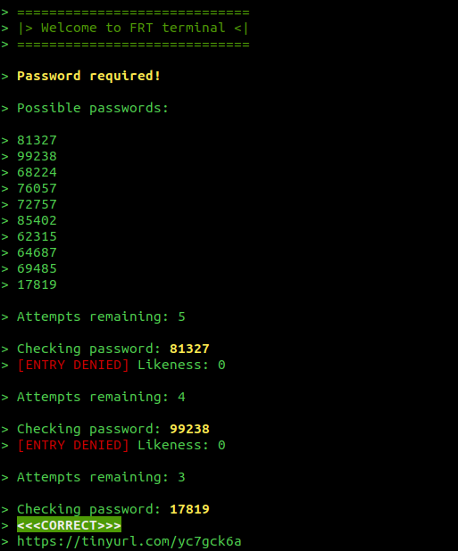
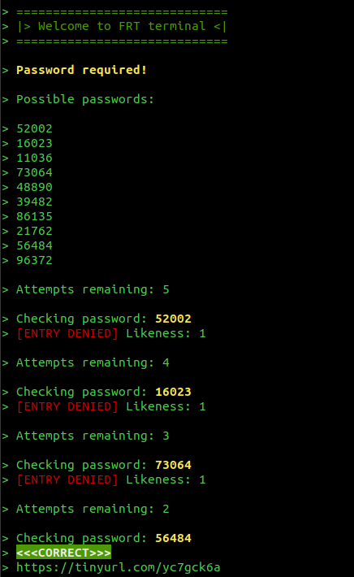

Flat Rock Technology Terminal
==============================

Getting started
------------------------------
1. Clone the repository
2. Edit the `index.php`
3. Run the code via `php index.php` inside your terminal/cmd.

Terminal API
------------------------------

The terminal API is very simple and expose just two function:

* `getAllPossible(): array` - Returns a flat array with all possible pass-codes

* `attempt(string $password): int` - Attempts to unlock the terminal via the passed pass code.  If the pass code is the right one, the terminal will be unlocked and the script will be terminated. If the pass code is wrong, the function will return an index of similarity (right character at right position). If the attempts are exhausted, the terminal will be blocked and the script will be terminated.

Similarity Index
-------------------------------

The similarity index is a integer that indicates how similar two pass codes are. The index is greater for each character that's matching and is in the right position.

Examples:

| Right pass code | Test pass code | Similarity index |
| --------------- | -------------- | ---------------- |
| 56484 | 45373 | 0 |
| 56484 | 52002 | 1 |
| 56484 | 16024 | 2 |
| 56484 | 50444 | 3 |
| 56484 | 50484 | 4 |

-------------------------------

Put in other example, the similarity index of `56484` and `16024` is `2` because:

| Position 4 | Position 3 | Position 2 | Position 1 | Positions 0 |
| ------- | ------- | ------- | ------- | ------- |
| 5 | **6** | 4 | 8 | **4** |
| 1 | **6** | 0 | 2 | **4** |
| - | **6** | - | - | **6** |


Example
-------------------------------

The following is a mockup example of what your solutions could look like.

Content of `index.php`:

```php
<?php
// -----------------------------------------------------------------------------------------------------------
// Bootstrap the terminal itself.
//
// DO NOT DELETE THIS LINE.
// -----------------------------------------------------------------------------------------------------------
require_once __DIR__ . '/src/bootstrap.php';

// -----------------------------------------------------------------------------------------------------------
// Place your code below
// -----------------------------------------------------------------------------------------------------------

// Get all possible pass codes
$possibleCodes = getAllPossible();

// Try picking the best pass code
$possibleCode = myAwesomeCrackingFunction($possibleCodes);

// Try the picked pass code
$similarity = attempt($possibleCode);

// Adjust the cracking algorithm according to the $similarity index and attempt again
// ...
// ...

```


Screenshots
-------------------------------




